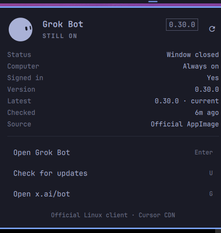

# Grok Bot for Omarchy

[](https://github.com/glorics/omarchy-grok-bot/releases/latest)
[](LICENSE)

Unofficial community bar widget by **glorics**. It launches the [Grok Bot](https://x.ai/bot) Linux client from the Omarchy bar: themed face, one click to open, **Connected** or **Window closed**.

This plugin is **not** Grok Bot, and it is **not** an xAI or Cursor product.

<p align="center">
  <video src="docs/widget-demo.mp4" width="400" controls muted loop playsinline></video>
  <video src="docs/widget-demo-open.mp4" width="400" controls muted loop playsinline></video>
</p>

<p align="center">
  
</p>

## What it does

- Puts a themed x.ai/bot face on the Omarchy bar
- Opens or focuses the Grok Bot Linux client
- Shows whether the window is open
- Can check Cursor's update feed and download a newer Linux AppImage into `~/Applications` when you ask it to

It does not read Grok Bot tokens, chats, or secret files.

## External dependency

The [Grok Bot Linux client](https://x.ai/bot) (AppImage). Install it yourself, or use **Check for updates** / **Update now** in the panel. Updates download from `downloads.cursor.com` into `~/Applications`. Removing the plugin does not remove the AppImage.

## Install

Plugins run unsandboxed inside `omarchy-shell`. Read this repository first.

```bash
omarchy plugin add https://github.com/glorics/omarchy-grok-bot.git --enable
```

```bash
omarchy plugin remove glorics.grok-bot
```

## Marketplace

Candidate listing: [omacom/omarchy-plugin-marketplace#3539](https://github.com/omacom/omarchy-plugin-marketplace/issues/3539).

## Also by glorics

[Proton VPN for Omarchy](https://github.com/glorics/omarchy-proton-vpn) — unofficial bar plugin: exit IP, map, Fastest / P2P / Secure Core / Tor. Official `protonvpn` CLI.

```bash
omarchy plugin add https://github.com/glorics/omarchy-proton-vpn.git --enable
```

## License

MIT for this plugin only. Grok Bot, the x.ai/bot mark, and the Linux AppImage belong to xAI / Cursor.
